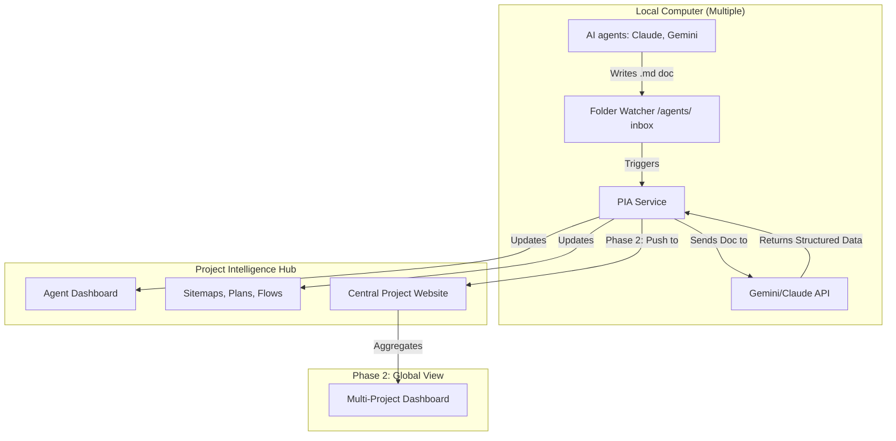

# Project Intelligence Agent (PIA) System

The goal is to build a project intelligence system that acts as a "Supervisor Agent." It monitors work documentation from other AI agents (Claude, Gemini), assesses the progress, and automatically updates project artifacts (dashboards, site maps, project plans).

## System Architecture

## User Review Required

> [!IMPORTANT]
> **AI API Key**: The "Intelligence" step requires an API key (Gemini Recommended for its large context window).
> **Naming Conventions**: To ensure the AI accurately updates site maps, we should decide on a consistent format for navigation and flow definitions.

## Proposed Components

### 1. The Watcher (Local Agent)

- **Action**: You tell the software: *"Watch these folders on this computer."*
- **Mechanism**: Use Node.js to monitor your dev folders (or a specific "Inbox").
- **Automation**: As soon as you copy/save a file there, it triggers the internal automation.

### 2. The Processing Central (The "Hub")

- **Action**: The Watcher copies the detected file into a central `PIA_PROCESSED` directory (optional sync step).
- **Terminal Automation**:
  - The terminal wakes up and runs `node tools/pia-assessment.mjs`.
  - It uses **AI** (Local or Cloud-API) to "read" the file.
- **Decision Engine**:
  - *"What does this mean for the site map?"* -> Finds the sitemap and suggests edits.
  - *"What does this mean for the dashboard?"* -> Updates the real-time status.
- **GPU Acceleration (RTX 5090 Mode)**:
  - On machines with high-end GPUs, we can run **Local LLMs** (e.g., Llama 3, Mistral) via Ollama instead of relying solely on Cloud APIs.
  - **Benefits**: Zero per-token costs, 24/7 processing without rate limits, and ultra-low latency for the Supervisor Agent.

### 3. Documentation "Auto-Healing"

- Instead of you manually editing your Site Map or Project Plan, the AI produces a "diff" (a list of changes) and applies it to the `.md` or `.html` files in your project.

### 4. Remote CLI Tunnel (The "Remote Keyboard")

To let you control your computer's CLI from a coffee shop, we build a **Virtual Bridge**:

#### A. The "Interceptor" (Local)

Instead of running Claude directly, you run a command like `node pia-tunnel.mjs`. This script "swallows" the Claude process.

- **PTY (Pseudo-Terminal)**: This is a tech that fools Claude into thinking it is talking to a real screen, but it is actually talking to our script.
- **I/O Capture**: Every word Claude types is captured; every key you press on your phone is "injected" into Claude's ear.

#### B. The "Live Mirror" (Cloud)

Our script acts like a radio station. It broadcasts the terminal's screen to your **Empire Website** in real-time.

- **WebSockets**: This is the "Wire" that stays open between your local computer and your phone.

#### C. The "Remote Hand" (Your Phone)

On your phone, you see a black window with green text (the terminal).

- When you type *"Yes, go ahead"* on your phone, my script locally types those exact letters into the terminal on your desk.
- It works exactly like **WhatsApp Web**, but for your computer's "brain" (the CLI).

#### Sequence of events

1. **AI Asks**: Claude stops and waits for you: *"Mic, which file should I edit?"*
2. **Alert**: Your phone pings. You see the question in the "Empire App."
3. **Human Reply**: You type *"Use the new one"* on your phone.
4. **Injection**: The PIA script on your PC receives it and "Types" it for Claude.
5. **Autonomous Resume**: Claude says *"Thanks!"* and continues working.

### 5. Autonomous Task Spawning (The "Orchestrator")

To allow the system to proactively start work without you:

- **Remote Trigger**: On your Empire Dashboard, you click a button: *"✨ Sync All Project Docs."*
- **The "Spawn" Action**: The PIA locally opens a **new** hidden terminal and runs the `claude` command.
- **Auto-Prompting**: Instead of waiting for you to type, the PIA "injects" a pre-written mission into Claude's ear:
  > *"Analyze my project and update the site map and project plan now."*
- **Progress Monitoring**: PIA watches the conversation and reports "Sync 80% complete" back to your phone.
- **Auto-Close**: Once Claude finishes, PIA closes the virtual terminal.

### 6. Empire Fleet Dashboard (The "Global Overview")

To see what "everyone" is working on across all machines (43+ agents):

- **Global Fleet Matrix**: A high-density "Wall of Data" view. Each agent is a small, interactive tile.
- **Tile Information**:
  - **Status Glow**: Green (Live), Pulsing Yellow (Waiting), Red (Error).
  - **CLI Mini-Stream**: A tiny area showing the last 3-5 words processed by that agent.
  - **Progress Sparkline**: A micro-chart of task completion.
- **"Deep Dive" Integration**: Clicking any matrix tile instantly opens the full Remote Console for that agent in a focus window.
- **Aggregation**: The Hub combines these pulses into a single **"Fleet Status"** screen.
- **Visualization**:
  - **Active Grid**: A list of all your projects (SodaWorld, DAO, etc.) and which agent is on them.
  - **Global Log**: A combined feed showing every auto-update happening across your entire "Empire."
  - **Centralized Alerts**: If Claude gets stuck on your *laptop* in the other room, it shows up as a red alert on your *main PC* dashboard.

### 7. Multi-PC Command (Phase 2)

- Each computer has this "Watcher" active.
- They all report back to your **Central Empire Website**, allowing you to see the real-time status of Project A (Main PC), Project B (Laptop), etc.

## Phase 2: Multi-Computer Aggregation

To see all projects in one place:

- **Local Agent**: Each computer runs its own PIA Service.
- **Cloud Sync**: The PIA Service can optionally push updates to a central database/website (e.g., a simple Firebase app or a central dashboard) so you can see "All Projects" globally.

## Verification Plan

### Stage 1: Local Listener

1. Start the watcher.
2. Drop `test-agent-update.md` into `agents/`.
3. Verify the console logs "New agent activity detected."

### Stage 2: AI Assessment

1. Mock the AI response to ensure the dashboard updates correctly.
2. Test live AI connection if API keys are provided.

### Stage 3: Doc Update

1. Create a dummy Sitemap.
2. Let the PIA update it based on a "New Page" description in an agent file.
